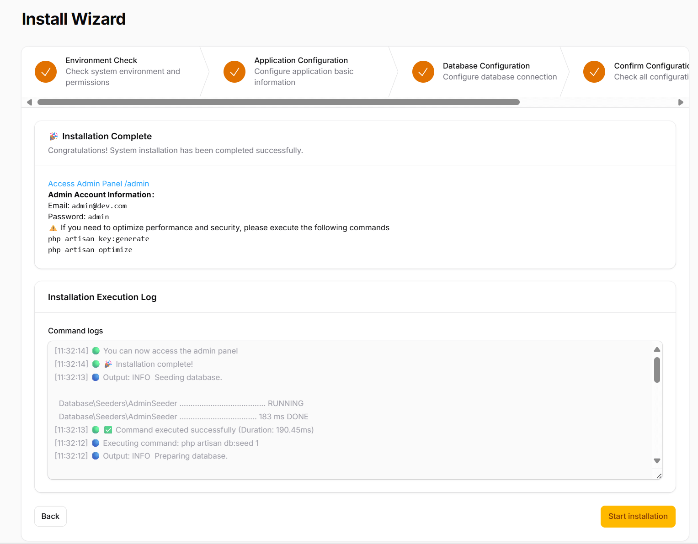
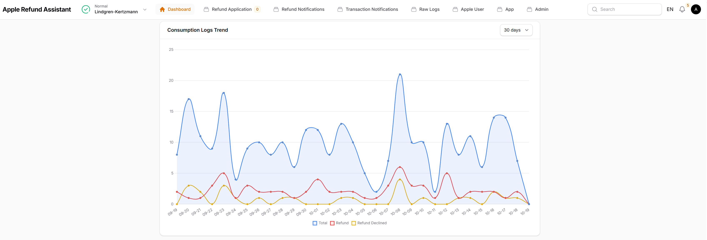

## apple-refund-assistant

[](https://sonarcloud.io/summary/new_code?id=seth-shi_apple-refund-assistant)
[](https://sonarcloud.io/summary/new_code?id=seth-shi_apple-refund-assistant)


[English](./README.md) | [简体中文](./README.zh.md) | [Español](./README.es.md) | [हिन्दी](./README.hi.md) | العربية | [Português](./README.pt.md) | [Русский](./README.ru.md) | [日本語](./README.ja.md) | [Français](./README.fr.md)

تم بناء هذه الخدمة على بنية Laravel / Filament متعددة المستأجرين،
وتساعد المطورين بشكل فعال على منع عمليات الاسترداد الاحتيالية من خلال معالجة إشعارات CONSUMPTION_REQUEST من Apple فوراً وإرجاع بيانات الاستهلاك بشكل غير متزامن.

- **دعم متعدد المستأجرين**
- **دعم متعدد اللغات** (中文 / English / Español / हिन्दी / العربية / Português / Русский / 日本語 / Français)
- **دعم متعدد العملات**
- **صفر تبعيات File+SQLite** `أو الترقية إلى Redis+MySQL`
- **100% تغطية الاختبارات**
- **مفاتيح التطبيق ذاتية الإدارة** المفاتيح الخاصة مخزنة فقط في جدول قاعدة البيانات `apps` الخاص بك (مع التشفير المتماثل، المفاتيح المولدة بواسطة تطبيقك)
- **12 حقل استهلاك** - [حساب جميع الحقول المطلوبة من Apple](#استراتيجية-حقول-الاستهلاك)
- **إعادة توجيه رسائل الإشعارات** يرسل خادم Apple إلى الخدمة الحالية، الخدمة الحالية تعيد التوجيه إلى خادم الإنتاج الخاص بك


## العرض التوضيحي عبر الإنترنت

🌐 **رابط العرض التوضيحي**: [https://apple-refund-assistant.shiguopeng.cn/](https://apple-refund-assistant.shiguopeng.cn/)

> ⚠️ **ملاحظة**: النظام يعيد التشغيل كل 30 دقيقة.

 
## لقطات الشاشة




## البدء السريع
### استخدام الصورة المبنية مسبقاً
```bash
docker run -d \
  -p 8080:8080 \
  --name apple-refund-assistant \
  --restart=always \
  ghcr.io/seth-shi/apple-refund-assistant:latest
```


### البناء والتشغيل المحلي
```bash
git clone https://github.com/seth-shi/apple-refund-assistant
cd apple-refund-assistant
## بناء الصورة ونشرها
./deploy.sh
```

### إذا كنت بحاجة إلى تحميل البيانات
```
touch database.sqlite
docker run -d \
  -p 8080:8080 \
  -v $(pwd)/database.sqlite:/var/www/html/database/database.sqlite \
  --name apple-refund-assistant \
  --restart=always \
  ghcr.io/seth-shi/apple-refund-assistant:latest
```

## استراتيجية حقول الاستهلاك
* الوثائق: [https://developer.apple.com/documentation/appstoreserverapi/consumptionrequest](https://developer.apple.com/documentation/appstoreserverapi/consumptionrequest)
* كود الاستراتيجية: [ConsumptionService.php](./app/Services/ConsumptionService.php) 
* يمكن تحديث حقول جدول `users` بواسطة أنظمة أخرى

| الحقل                       | الوصف                | مصدر البيانات                          | قاعدة الحساب                                                                                           |
|--------------------------|-------------------|--------------------------------|------------------------------------------------------------------------------------------------|
| accountTenure            | أيام تسجيل المستخدم            | `users.register_at`            | الوقت الحالي ناقص وقت التسجيل                                                                                     |
| appAccountToken          | رمز الحساب          | `users.app_account_token`      | [يجب تمريره عند إنشاء العميل للطلب](https://developer.apple.com/documentation/StoreKit/Transaction/appAccountToken) |
| consumptionStatus        | حالة الاستهلاك              | `transactions.expiration_date` | مقارنة مع الوقت الحالي، إذا انتهت الصلاحية إرجاع مستهلك                                                                              |
| customerConsented        | موافقة المستخدم على تقديم البيانات          | لا شيء                              | مُشفر `true`                                                                                       |
| deliveryStatus           | ما إذا تم تسليم عملية شراء داخل التطبيق بنجاح. | لا شيء                              | مُشفر `0`(تسليم عادي)                                                                                    |
| lifetimeDollarsPurchased | إجمالي مبلغ الشراء داخل التطبيق             | `users.purchased_dollars`      | تراكم هذا الحقل بناءً على أحداث معاملات Apple، يمكنك أيضاً تراكمه بنفسك                                                                        |
| lifetimeDollarsRefunded  | إجمالي مبلغ الاسترداد             | `users.refunded_dollars`       | تراكم هذا الحقل بناءً على أحداث استرداد Apple، يمكنك أيضاً تراكمه بنفسك                                                                        |
| platform                 | المنصة                | لا شيء                              | مُشفر `1`(apple)                                                                                   |
| playTime                 | قيمة وقت استخدام التطبيق من قبل العميل        | `users.play_seconds`           | يحتاج نظامك إلى دعم تحديث هذا الحقل، وإلا فهو `0`                                                                          |
| refundPreference         | النتيجة المتوقعة لطلب الاسترداد         | `transactions.expiration_date` | مقارنة مع الوقت الحالي، إذا انتهت الصلاحية نأمل في رفض الاسترداد                                                                             |
| sampleContentProvided    | ما إذا تم تقديم تجربة            | `apps.sample_content_provided` | تكوين التطبيق عند إنشاء التطبيق                                                                                      |
| userStatus               | حالة المستخدم              | لا شيء                              | مُشفر `1`(مستخدم عادي)                                                                                   |

## الخطط المستقبلية
- هل لديك أفكار أخرى أو مهتم بالتعاون؟ يرجى إرسال issue على GitHub - نتطلع إلى ملاحظاتك!

## شكر وتقدير
* [Rates By Exchange Rate API](https://www.exchangerate-api.com)
* [https://github.com/argus-sight/refund-swatter-lite](https://github.com/argus-sight/refund-swatter-lite)