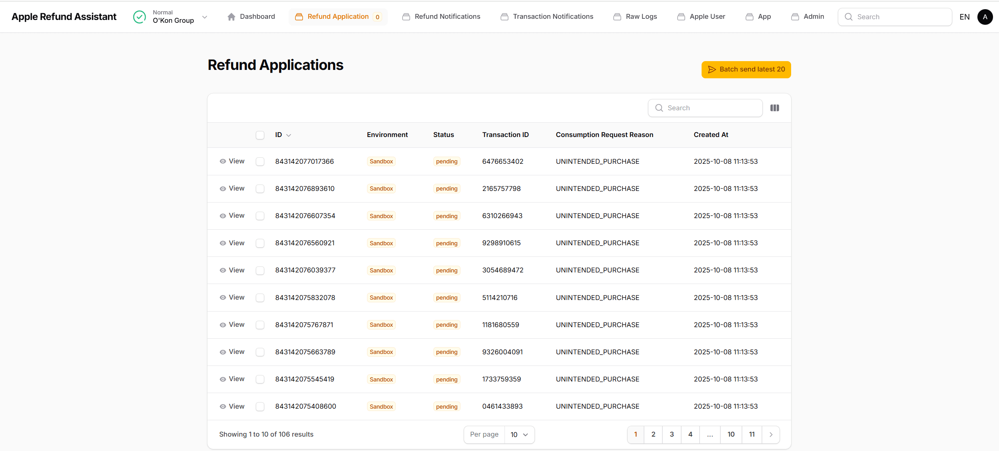

## Apple रिफंड असिस्टेंट

[English](./README.md) | [简体中文](./README.zh.md) | [Español](./README.es.md) | हिन्दी | [العربية](./README.ar.md) | [Português](./README.pt.md) | [Русский](./README.ru.md) | [日本語](./README.ja.md) | [Français](./README.fr.md)

Laravel आधारित मल्टी-टेनेंट पेमेंट रिफंड रोकथाम सेवा।


## लाइव डेमो

🌐 **डेमो साइट**: [https://apple-refund-assistant.shiguopeng.cn/](https://apple-refund-assistant.shiguopeng.cn/)

> ⚠️ **नोट**: सिस्टम हर 30 मिनट में रीसेट हो जाएगा।

## अवलोकन

Apple के CONSUMPTION_REQUEST नोटिफिकेशन को रीयल-टाइम में प्रोसेस करें और तुरंत Apple को उपभोग जानकारी वापस भेजें, धोखाधड़ी वाले रिफंड को कम करने में मदद करें।


- **मल्टी-करेंसी सपोर्ट**
- **मल्टी-टेनेंट सपोर्ट**
- **मल्टी-लैंग्वेज सपोर्ट (中文 / English / Español / हिन्दी / العربية / Português / Русский / 日本語 / Français)**
- **शून्य निर्भरता - तेज़ तैनाती के लिए स्थानीय सेवा सीधे शुरू करें**

| निर्भरता | शून्य निर्भरता |  उन्नत   |
|-----|--|-----|
|  डेटाबेस   | sqlite | MySQL |
|  कैश   | file | redis  |
|   सत्र | file |  redis   |
- **Webhook** API **100%** टेस्ट कवरेज के साथ
- **स्व-प्रबंधित कुंजी** - निजी कुंजी केवल आपके डेटाबेस `apps` तालिका में संग्रहीत हैं (सममित एन्क्रिप्शन के साथ, आपके एप्लिकेशन द्वारा उत्पन्न कुंजी)
- **12 उपभोग फील्ड** - सभी आवश्यक Apple फील्ड की गणना करें
- सर्वर संदेश फॉरवर्डिंग सपोर्ट
  - Apple सर्वर वर्तमान सेवा को भेजता है, जो आपके उत्पादन सर्वर को फॉरवर्ड करता है

 
## स्क्रीनशॉट





## त्वरित शुरुआत
### पूर्व-निर्मित इमेज का उपयोग करना
```bash
docker run -d \
  -p 8080:8080 \
  --name apple-refund-assistant \
  --restart=always \
  ghcr.io/seth-shi/apple-refund-assistant:latest
```


### स्थानीय रूप से बनाएं और चलाएं
```bash
git clone https://github.com/seth-shi/apple-refund-assistant
cd apple-refund-assistant
## इमेज बनाएं और तैनात करें
./deploy.sh
```

### यदि आपको डेटा माउंट करने की आवश्यकता है
```
touch database.sqlite
docker run -d \
  -p 8080:8080 \
  -v $(pwd)/database.sqlite:/var/www/html/database/database.sqlite \
  --name apple-refund-assistant \
  --restart=always \
  ghcr.io/seth-shi/apple-refund-assistant:latest
```

## उपभोग फील्ड रणनीति
* दस्तावेज़ीकरण: [https://developer.apple.com/documentation/appstoreserverapi/consumptionrequest](https://developer.apple.com/documentation/appstoreserverapi/consumptionrequest)
* रणनीति कोड: [ConsumptionService.php](./app/Services/ConsumptionService.php) 
* `users` तालिका फील्ड अन्य सिस्टम द्वारा अपडेट किए जा सकते हैं

| फील्ड                       | विवरण                | डेटा स्रोत                          | गणना नियम                                                                                           |
|--------------------------|-------------------|--------------------------------|------------------------------------------------------------------------------------------------|
| accountTenure            | उपयोगकर्ता पंजीकरण के बाद से दिन            | `users.register_at`            | वर्तमान समय माइनस पंजीकरण समय                                                                                     |
| appAccountToken          | खाता टोकन          | `users.app_account_token`      | [क्लाइंट ऑर्डर बनाते समय पास होना चाहिए](https://developer.apple.com/documentation/StoreKit/Transaction/appAccountToken) |
| consumptionStatus        | उपभोग स्थिति              | `transactions.expiration_date` | वर्तमान समय के साथ तुलना करें, यदि समाप्त हो गया तो उपभोग किया हुआ रिटर्न करें                                                                              |
| customerConsented        | उपयोगकर्ता ने डेटा प्रदान करने के लिए सहमति दी          | N/A                              | हार्डकोडेड `true`                                                                                       |
| deliveryStatus           | क्या एक कार्यात्मक इन-ऐप खरीद सफलतापूर्वक डिलीवर की गई थी | N/A                              | हार्डकोडेड `0` (सामान्य डिलीवरी)                                                                                    |
| lifetimeDollarsPurchased | कुल इन-ऐप खरीद राशि             | `users.purchased_dollars`      | Apple लेनदेन इवेंट के आधार पर संचित, या आप मैन्युअल रूप से संचय कर सकते हैं                                                                        |
| lifetimeDollarsRefunded  | कुल रिफंड राशि             | `users.refunded_dollars`       | Apple रिफंड इवेंट के आधार पर संचित, या आप मैन्युअल रूप से संचय कर सकते हैं                                                                        |
| platform                 | प्लेटफ़ॉर्म                | N/A                              | हार्डकोडेड `1` (apple)                                                                                   |
| playTime                 | ग्राहक ऐप उपयोग समय मूल्य        | `users.play_seconds`           | आपके सिस्टम को इस फील्ड को अपडेट करने का समर्थन करना होगा, अन्यथा यह `0` है                                                                          |
| refundPreference         | रिफंड अनुरोध के लिए अपेक्षित परिणाम         | `transactions.expiration_date` | वर्तमान समय के साथ तुलना करें, यदि समाप्त हो गया तो रिफंड अस्वीकार करना पसंद करें                                                                             |
| sampleContentProvided    | क्या ट्रायल प्रदान किया गया है            | `apps.sample_content_provided` | ऐप बनाते समय कॉन्फ़िगर करें                                                                                      |
| userStatus               | उपयोगकर्ता स्थिति              | N/A                              | हार्डकोडेड `1` (सामान्य उपयोगकर्ता)                                                                                   |


## लाइसेंस

Apache License 2.0 के तहत लाइसेंस प्राप्त, विवरण के लिए [LICENSE](./LICENSE) देखें।

## सहायता

प्रश्नों या चिंताओं के लिए, कृपया GitHub पर एक issue सबमिट करें।

## भविष्य की योजनाएं
- अन्य विचार हैं या सहयोग में रुचि है? कृपया GitHub पर एक issue सबमिट करें - हम आपकी प्रतिक्रिया की प्रतीक्षा कर रहे हैं!

## आभार
* [Rates By Exchange Rate API](https://www.exchangerate-api.com)

