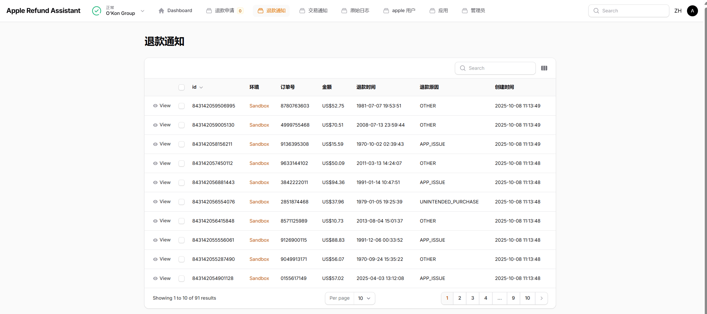

## apple-refund-assistant


[English](./README.md) | [简体中文](./README.zh.md) | [Español](./README.es.md) | [हिन्दी](./README.hi.md) | [العربية](./README.ar.md) | [Português](./README.pt.md) | [Русский](./README.ru.md) | 日本語 | [Français](./README.fr.md)

このサービスはLaravel / Filamentマルチテナントアーキテクチャ上に構築されており、
AppleのCONSUMPTION_REQUEST通知を即座に処理し、消費データを非同期で返すことで、開発者が詐欺的な返金を防ぐのに効果的に役立ちます。

- **マルチテナントサポート**
- **マルチ言語サポート** (中文 / English / Español / हिन्दी / العربية / Português / Русский / 日本語 / Français)
- **マルチ通貨サポート**
- **ゼロ依存関係 File+SQLite** `またはRedis+MySQLにアップグレード`
- **100%テストカバレッジ**
- **自己管理アプリキー** 秘密鍵はデータベース`apps`テーブルにのみ保存されます（対称暗号化、アプリケーションで生成されたキー）
- **12消費フィールド** - [必要なAppleフィールドをすべて計算](#消費フィールド戦略)
- **通知メッセージ転送** Appleサーバーが現在のサービスに送信、現在のサービスが本番サーバーに転送


## オンラインデモ

🌐 **デモURL**: [https://apple-refund-assistant.shiguopeng.cn/](https://apple-refund-assistant.shiguopeng.cn/)

> ⚠️ **注意**: システムは30分ごとにリセットされます。

 
## スクリーンショット





## クイックスタート
### 事前構築済みイメージの使用
```bash
docker run -d \
  -p 8080:8080 \
  --name apple-refund-assistant \
  --restart=always \
  ghcr.io/seth-shi/apple-refund-assistant:latest
```


### ローカルビルドと実行
```bash
git clone https://github.com/seth-shi/apple-refund-assistant
cd apple-refund-assistant
## イメージをビルドしてデプロイ
./deploy.sh
```

### データをマウントする必要がある場合
```
touch database.sqlite
docker run -d \
  -p 8080:8080 \
  -v $(pwd)/database.sqlite:/var/www/html/database/database.sqlite \
  --name apple-refund-assistant \
  --restart=always \
  ghcr.io/seth-shi/apple-refund-assistant:latest
```

## 消費フィールド戦略
* ドキュメント: [https://developer.apple.com/documentation/appstoreserverapi/consumptionrequest](https://developer.apple.com/documentation/appstoreserverapi/consumptionrequest)
* 戦略コード: [ConsumptionService.php](./app/Services/ConsumptionService.php) 
* `users`テーブルフィールドは他のシステムによって更新可能

| フィールド                       | 説明                | データソース                          | 計算ルール                                                                                           |
|--------------------------|-------------------|--------------------------------|------------------------------------------------------------------------------------------------|
| accountTenure            | ユーザー登録日数            | `users.register_at`            | 現在時刻から登録時刻を引く                                                                                     |
| appAccountToken          | アカウントトークン          | `users.app_account_token`      | [クライアントが注文作成時に渡す必要がある](https://developer.apple.com/documentation/StoreKit/Transaction/appAccountToken) |
| consumptionStatus        | 消費状況              | `transactions.expiration_date` | 現在時刻と比較、期限切れの場合は消費済みを返す                                                                              |
| customerConsented        | ユーザーのデータ提供同意          | なし                              | ハードコード`true`                                                                                       |
| deliveryStatus           | 機能的なアプリ内購入が正常に配信されたか。 | なし                              | ハードコード`0`(正常配信)                                                                                    |
| lifetimeDollarsPurchased | アプリ内購入総額             | `users.purchased_dollars`      | Appleトランザクションイベントに基づいてこのフィールドを累積、自分で累積することも可能                                                                        |
| lifetimeDollarsRefunded  | 返金総額             | `users.refunded_dollars`       | Apple返金イベントに基づいてこのフィールドを累積、自分で累積することも可能                                                                        |
| platform                 | プラットフォーム                | なし                              | ハードコード`1`(apple)                                                                                   |
| playTime                 | 顧客のアプリ使用時間値        | `users.play_seconds`           | システムがこのフィールドの更新をサポートする必要がある、そうでなければ`0`                                                                          |
| refundPreference         | 返金リクエストの期待結果         | `transactions.expiration_date` | 現在時刻と比較、期限切れの場合は返金拒否を希望                                                                             |
| sampleContentProvided    | 試用版が提供されるか            | `apps.sample_content_provided` | アプリ作成時にアプリを設定                                                                                      |
| userStatus               | ユーザー状況              | なし                              | ハードコード`1`(正常ユーザー)                                                                                   |

## 将来の計画
- 他のアイデアがある、または協力に興味がありますか？GitHubでissueを送信してください - フィードバックをお待ちしています！

## 謝辞
* [Rates By Exchange Rate API](https://www.exchangerate-api.com)
* [https://github.com/argus-sight/refund-swatter-lite](https://github.com/argus-sight/refund-swatter-lite)