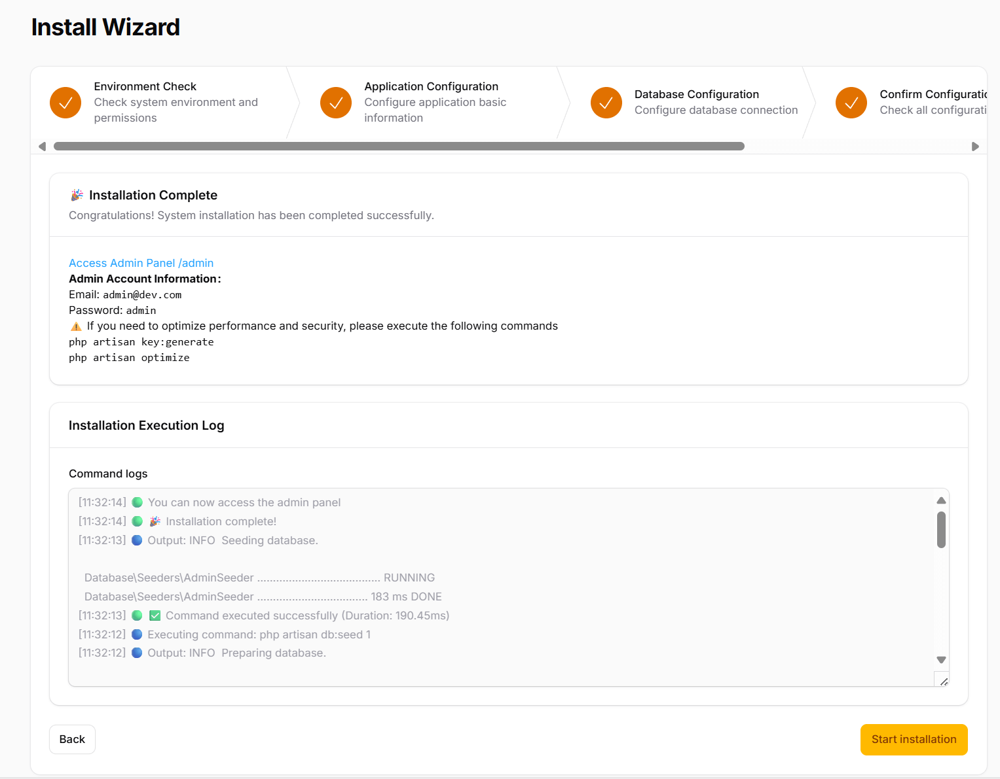
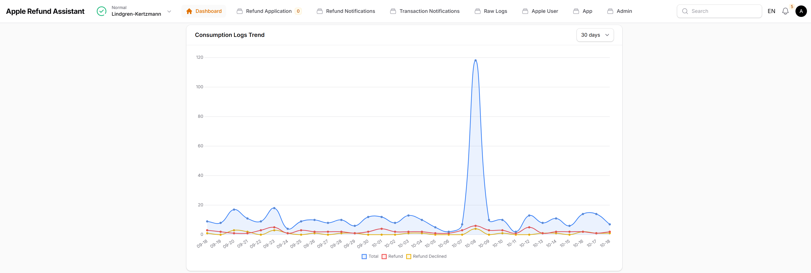
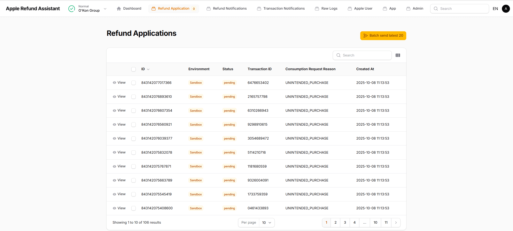
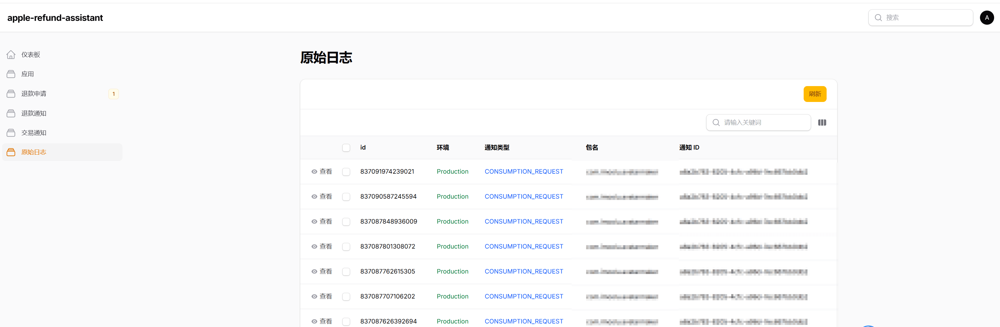
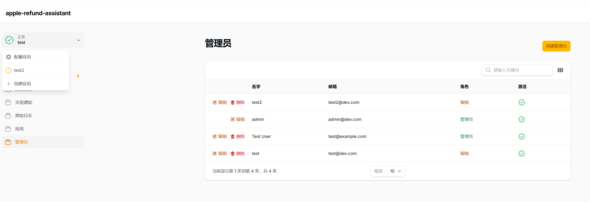
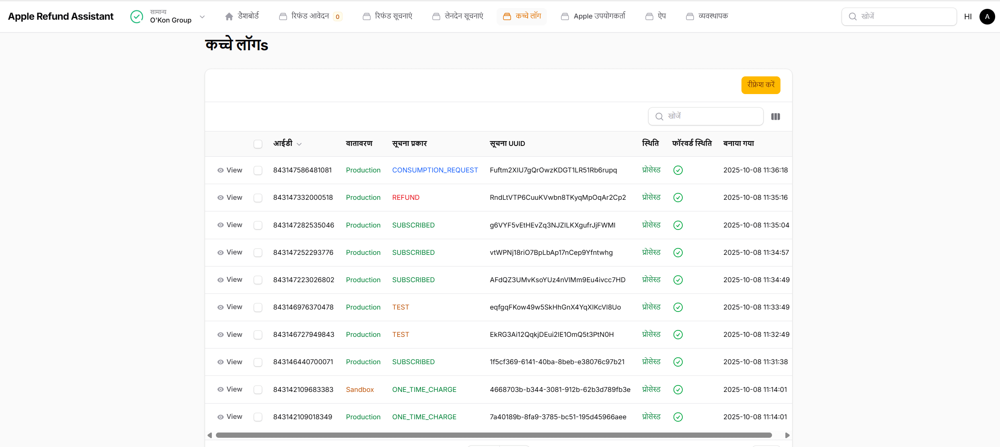

## apple-refund-assistant


[English](./README.md) | [简体中文](./README.zh.md) | [Español](./README.es.md) | [हिन्दी](./README.hi.md) | [العربية](./README.ar.md) | Português | [Русский](./README.ru.md) | [日本語](./README.ja.md) | [Français](./README.fr.md)

Este serviço é construído na arquitetura multi-tenant Laravel / Filament,
ajudando efetivamente os desenvolvedores a prevenir reembolsos fraudulentos processando instantaneamente as notificações CONSUMPTION_REQUEST da Apple e retornando dados de consumo de forma assíncrona.

- **Suporte Multi-tenant**
- **Suporte Multi-idioma** (中文 / English / Español / हिन्दी / العربية / Português / Русский / 日本語 / Français)
- **Suporte Multi-moeda**
- **Zero Dependências File+SQLite** `ou atualize para Redis+MySQL`
- **100% Cobertura de Testes**
- **Chaves de Aplicação Auto-gerenciadas** As chaves privadas são armazenadas apenas na sua tabela de banco de dados `apps` (com criptografia simétrica, chaves geradas pelo seu aplicativo)
- **12 Campos de Consumo** - [Calcular todos os campos necessários da Apple](#estratégia-de-campos-de-consumo)
- **Encaminhamento de Mensagens de Notificação** O servidor da Apple envia para o serviço atual, o serviço atual encaminha para o seu servidor de produção


## Demo Online

🌐 **URL do Demo**: [https://apple-refund-assistant.shiguopeng.cn/](https://apple-refund-assistant.shiguopeng.cn/)

> ⚠️ **Nota**: O sistema reinicia a cada 30 minutos.

 
## Screenshots








## Início Rápido
### Usando Imagem Pré-construída
```bash
docker run -d \
  -p 8080:8080 \
  --name apple-refund-assistant \
  --restart=always \
  ghcr.io/seth-shi/apple-refund-assistant:latest
```


### Construção e Execução Local
```bash
git clone https://github.com/seth-shi/apple-refund-assistant
cd apple-refund-assistant
## Construir imagem e implantar
./deploy.sh
```

### Se você precisar montar dados
```
touch database.sqlite
docker run -d \
  -p 8080:8080 \
  -v $(pwd)/database.sqlite:/var/www/html/database/database.sqlite \
  --name apple-refund-assistant \
  --restart=always \
  ghcr.io/seth-shi/apple-refund-assistant:latest
```

## Estratégia de Campos de Consumo
* Documentação: [https://developer.apple.com/documentation/appstoreserverapi/consumptionrequest](https://developer.apple.com/documentation/appstoreserverapi/consumptionrequest)
* Código da Estratégia: [ConsumptionService.php](./app/Services/ConsumptionService.php) 
* Os campos da tabela `users` podem ser atualizados por outros sistemas

| Campo                       | Descrição                | Fonte de Dados                          | Regra de Cálculo                                                                                           |
|--------------------------|-------------------|--------------------------------|------------------------------------------------------------------------------------------------|
| accountTenure            | Dias de registro do usuário            | `users.register_at`            | Tempo atual menos tempo de registro                                                                                     |
| appAccountToken          | Token da conta          | `users.app_account_token`      | [Precisa ser passado quando o cliente cria pedido](https://developer.apple.com/documentation/StoreKit/Transaction/appAccountToken) |
| consumptionStatus        | Status de consumo              | `transactions.expiration_date` | Comparar com tempo atual, se expirado retornar consumido                                                                              |
| customerConsented        | Consentimento do usuário para fornecer dados          | Nenhum                              | Codificado `true`                                                                                       |
| deliveryStatus           | Se entregou com sucesso uma compra in-app funcional. | Nenhum                              | Codificado `0`(entrega normal)                                                                                    |
| lifetimeDollarsPurchased | Valor total de compras in-app             | `users.purchased_dollars`      | Acumular este campo baseado em eventos de transação da Apple, você também pode acumular você mesmo                                                                        |
| lifetimeDollarsRefunded  | Valor total de reembolsos             | `users.refunded_dollars`       | Acumular este campo baseado em eventos de reembolso da Apple, você também pode acumular você mesmo                                                                        |
| platform                 | Plataforma                | Nenhum                              | Codificado `1`(apple)                                                                                   |
| playTime                 | Valor de tempo de uso do app pelo cliente        | `users.play_seconds`           | Seu sistema precisa suportar atualizar este campo, senão é `0`                                                                          |
| refundPreference         | Resultado esperado da solicitação de reembolso         | `transactions.expiration_date` | Comparar com tempo atual, se expirado esperar rejeitar reembolso                                                                             |
| sampleContentProvided    | Se é fornecido teste            | `apps.sample_content_provided` | Configurar app ao criar app                                                                                      |
| userStatus               | Status do usuário              | Nenhum                              | Codificado `1`(usuário normal)                                                                                   |

## Planos Futuros
- Tem outras ideias ou está interessado em colaboração? Por favor envie um issue no GitHub - esperamos seu feedback!

## Agradecimentos
* [Rates By Exchange Rate API](https://www.exchangerate-api.com)
* [https://github.com/argus-sight/refund-swatter-lite](https://github.com/argus-sight/refund-swatter-lite)